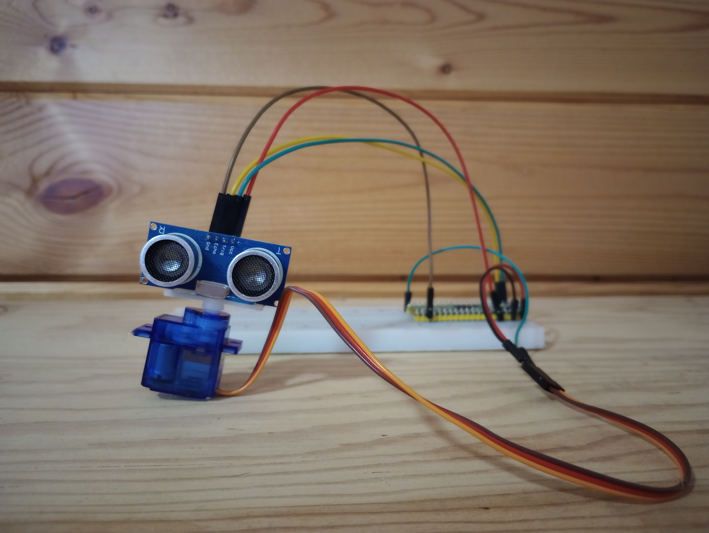

# Purpose
The goal of this project is to use to develop a radar,
using the libraries I have previously developed.

# Requirements
Raspberry Pi Pico <br/>
Ultrasonic sensor(HC-SR04) <br/>
Servo <br/>



## Graphical representation of radar data


## Code Explanation
This code is the core of the program. <br/>
The function takes the objects servo and sensor as its paramerters. <br/>
Its also takes a map and returns the map containing pairs of degrees and distance. <br/>
The distance is measured in inches. <br/>

## For Example
{degrees,distance(in)}
```cpp
std::map<float,float> radar_map = {
    {107.2,3},
    {118.3,6}
}
```

The last parameter named accuracy, increases the "resolution" or accuracy of the radar. <br/>
By default the accuacy is 0.05. <br/>
It is recommended not to increase the number beyond 0.09 <br/>

```cpp
std::map<float,float> update_radar(Servo ser, Ultrasonic sen, std::map<float,float> &radar_map, float accuracy = 0.05){
    for (float i = 0; i<120;i += 1/accuracy){
        ser.position(i*hertz_servo_const);
        sleep_ms(10/accuracy);
        radar_map[i] = sen.getdistance();
        
    }
    return radar_map;
}
```

Once the function update_radar is called. <br/>
The data is transfered over serial to the python application named gui.py. <br/>

```cpp
for (auto const &pair: radar_map) {
    printf("%g:",pair.first);
    printf("%g\n",pair.second);
}
```

# Help
If you are not familiar with the classes Ultrasonic and Servo. <br/>
Then Refer to the respository named servo-ultrasonic. <br/>
Check out the code of this repository for further explanation. <br/>